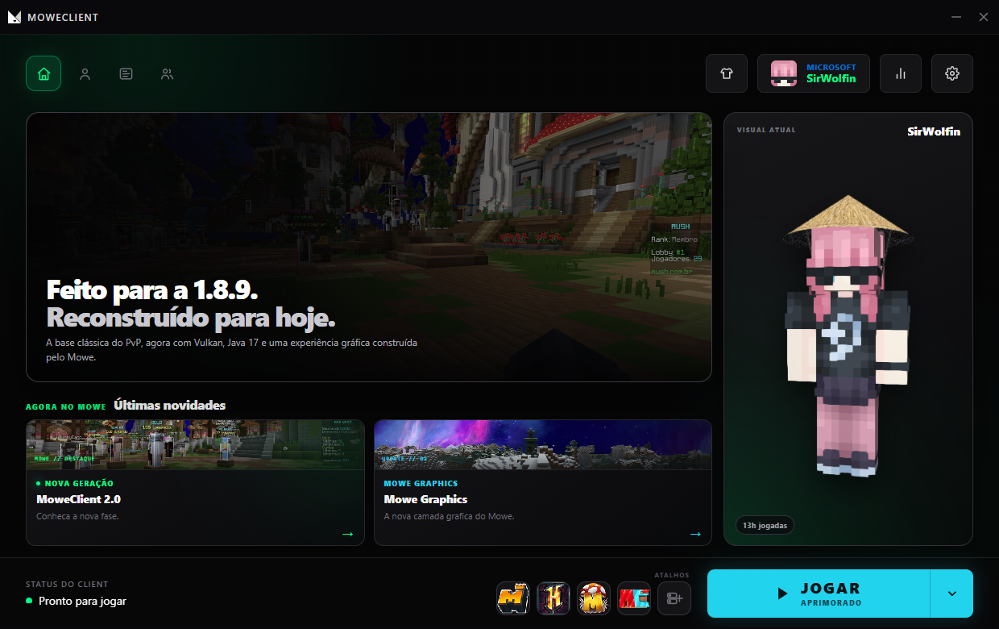

<div align="center">
  
  <h1>MoweClient</h1>
  <p><strong>Feito para a 1.8.9. Reconstruído para hoje.</strong></p>
  <p>Minecraft 1.8.9 com launcher próprio, Mowe Graphics e uma experiência conectada do download aos cosméticos.</p>

  <p>
    <a href="https://moweclient.com.br/">Site</a> ·
    <a href="https://github.com/gustamiguel/MoweLauncher/releases/latest">Download</a> ·
    <a href="https://moweclient.com.br/#news">Novidades</a> ·
    <a href="https://moweclient.com.br/#faq">FAQ</a>
  </p>

  [](https://github.com/gustamiguel/MoweLauncher/releases/latest)
  [](https://github.com/gustamiguel/MoweLauncher/releases/latest)
  [](https://github.com/gustamiguel/MoweLauncher/releases/latest)
</div>

<br>



## O que é o MoweClient?

O MoweClient reconstrói a experiência PvP do Minecraft 1.8.9 sem abandonar a versão que os jogadores conhecem. O launcher prepara o ambiente, mantém o client atualizado e conecta sua Conta Mowe aos perfis Minecraft, aparência, cosméticos e histórico de jogo.

O projeto é desenvolvido de forma independente por Gustavo Miguel.

## Mowe Graphics

Mowe Graphics é a camada própria que reúne gráficos, desempenho e os próximos recursos visuais do client.

| Perfil | Para que serve |
|---|---|
| **Desempenho** | Uma experiência mais leve e direta para jogar e competir. |
| **Renderização aprimorada** | Usa melhor a placa de vídeo em mapas e cenas mais pesadas. |
| **Iluminação avançada** | O futuro modo Ray Tracing do Mowe, ainda em desenvolvimento. |

Por baixo da interface, o client utiliza uma base Vulkan, Java 17 e LWJGL 3. O launcher cuida do runtime necessário para o jogador não precisar preparar o Java manualmente.

## Um ecossistema conectado

```text
Launcher  ──  Conta Mowe  ──  Client
    │              │             │
Atualizações    Perfis       Mowe Graphics
Servidores      Skins        Cosméticos
Download        Histórico    Aparência
```

- **Perfis Minecraft:** suporte a contas Microsoft verificadas e perfis offline.
- **Aparência:** skins, histórico, capas personalizadas e cosméticos por perfil.
- **Loja integrada:** preview, carrinho, pedidos e entrega digital na Conta Mowe.
- **Histórico de jogo:** tempo jogado, sessões e servidores recentes.
- **Atualizações:** o launcher verifica e prepara as versões antes de iniciar o jogo.

> Um perfil offline não comprova propriedade do Minecraft e não libera acesso a servidores que exigem uma conta oficial.

## Download

Baixe sempre pela página oficial de releases:

- [Windows — instalador `.exe`](https://github.com/gustamiguel/MoweLauncher/releases/latest)
- [Linux — pacote `.AppImage`](https://github.com/gustamiguel/MoweLauncher/releases/latest)

O client exige uma placa de vídeo e drivers compatíveis com Vulkan. A compatibilidade pode variar conforme o hardware, sistema e versão do driver.

## Links oficiais

- [Site e Conta Mowe](https://moweclient.com.br/)
- [Loja](https://moweclient.com.br/#store)
- [Novidades](https://moweclient.com.br/#news)
- [Política de Privacidade](https://moweclient.com.br/privacidade/)
- [Termos de Uso](https://moweclient.com.br/termos/)
- [Suporte](mailto:suporte@moweclient.com.br)

## Aviso

MoweClient é um projeto independente e não possui afiliação oficial, patrocínio ou endosso da Mojang AB ou Microsoft Corporation. Minecraft é uma marca de seus respectivos proprietários.

<div align="center">
  <sub>Construído de forma independente por Gustavo Miguel.</sub>
</div>
